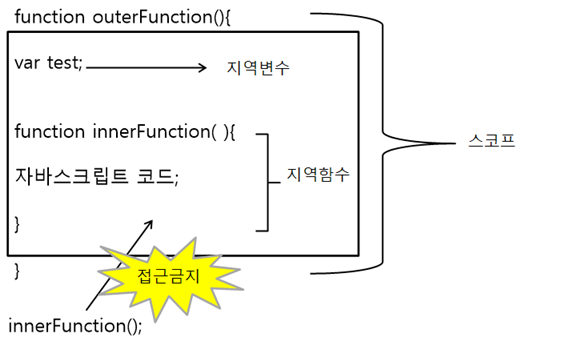
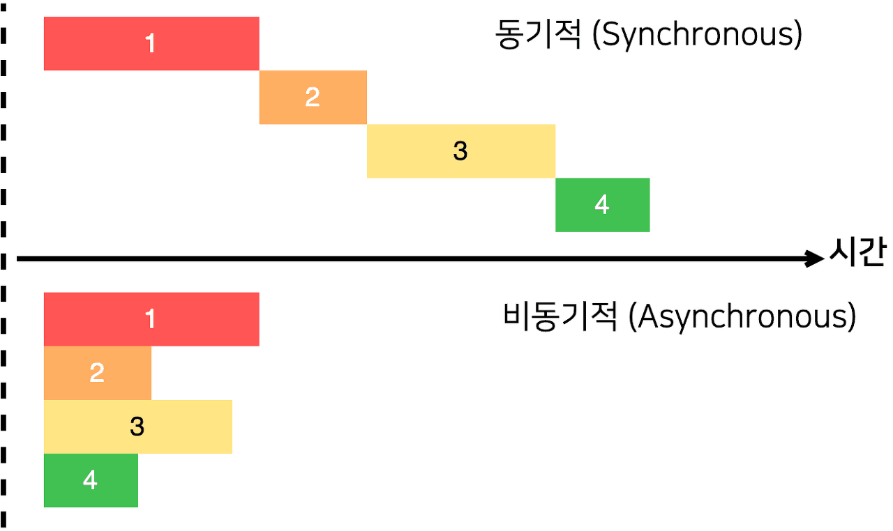
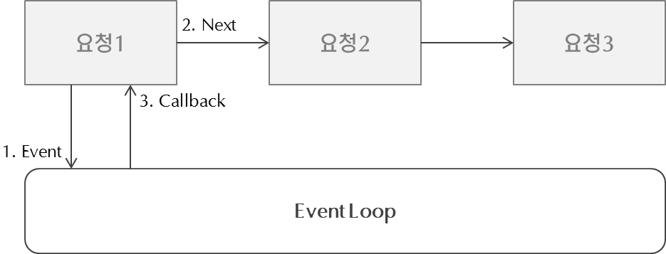
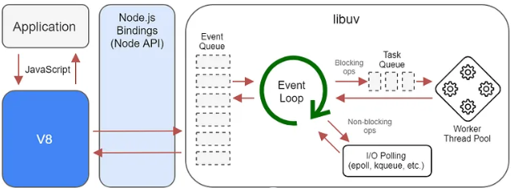

# 함수
함수는 특정 작업이나 계산을 수행하는 코드 블록으로, 입력값을 받아 처리한 후 결과를 반환하는 구조이다. 함수는 프로그래밍에서 코드의 재사용성과 가독성을 높이는 데 중요한 역할을 한다. 자바스크립트와 같은 프로그래밍 언어에서 함수는 독립적인 단위로, 필요할 때마다 호출하여 사용할 수 있다.

## 함수 선언과 호출

함수는 특정 작업을 수행하는 코드 블록으로, 자바스크립트에서 재사용 가능한 코드를 작성하는 데 매우 유용하다. 함수는 선언 후 필요할 때 호출하여 사용할 수 있다.


### 1. 함수 선언

함수는 `function` 키워드를 사용하여 선언한다. 함수 선언 시 함수 이름, 매개변수, 그리고 함수의 구현 내용을 정의한다.


#### 기본 구조

```javascript
function 함수이름(매개변수1, 매개변수2, ...) {
    // 함수가 수행할 코드
    return 반환값; // 선택 사항
}

```

```
// 함수 예제

function add(a, b) {
    return a + b; // 두 매개변수의 합을 반환
}
```

### 2. 함수 호출
함수를 호출하려면 함수 **이름과 괄호**를 사용한다. 괄호 안에는 함수에 전달할 인수를 넣을 수 있다.

#### 기본구조
```
// 함수 호출문 
함수이름(인수1, 인수2, ...);
```

```
let result = add(5, 10); // add 함수를 호출하여 5와 10을 전달
console.log(result); // 15 출력
```

### 3. 함수의 매개변수와 인수
- 매개변수: 함수 선언 시 정의하는 변수로, 함수가 호출될 때 전달되는 값을 받을 준비가 되어 있다.
- 인수: 함수를 호출할 때 전달하는 실제 값이다.

```
function greet(name) {
    return "안녕하세요, " + name + "님!";
}

console.log(greet("홍길동")); // "안녕하세요, 홍길동님!" 출력
```
위 예제에서 name은 매개변수이고, "홍길동"은 인수이다.

###  기본 매개변수
자바스크립트는 함수의 매개변수에 기본값을 설정할 수 있다. 이를 통해 인수가 전달되지 않았을 때 기본값을 사용할 수 있다.
```
function multiply(a, b = 1) {
    return a * b; // b가 전달되지 않으면 기본값 1 사용
}

console.log(multiply(5)); // 5 출력
console.log(multiply(5, 2)); // 10 출력
```


#### 결론
함수는 자바스크립트에서 중요한 프로그래밍 개념으로, 코드의 재사용성과 가독성을 높이는 데 기여한다. 함수 선언과 호출, 매개변수와 인수의 개념을 이해하고 활용하면, 더 효율적이고 구조적인 코드를 작성할 수 있다.


## 함수 표현식과 화살표 함수
1. 함수 표현식:<br>
함수 표현식은 함수를 변수에 할당하여 사용할 수 있는 방식이다. 이는 함수 선언식과 달리 호출 전에 정의되어야 한다.

2. 화살표 함수:<br>
화살표 함수는 간결한 문법으로 함수를 정의하며, this 바인딩 방식이 일반 함수와 다르다.
    - 일반 함수는 실행 컨텍스트에 따라 동적으로 this를 설정한다.
    - 화살표 함수는 선언 시점의 this를 고정적으로 유지한다.

3. 일급 객체로서의 함수:<br>
자바스크립트의 함수는 일급 객체로 다음 특징을 가진다.
    - 변수에 할당될 수 있다.
    - 다른 함수의 매개변수로 전달될 수 있다.
    - 다른 함수의 반환값으로 사용될 수 있다.


## 표현식
```js
// 함수 표현식
const functionName = function(parameters) {
    // 함수 본문
    return value;
};

// 화살표 함수
const functionName = (parameters) => {
    // 함수 본문
    return value;
};
```


### this 바인딩의 차이
1. 일반 함수의 this:<br>
    - 일반 함수에서 this는 호출 위치에 따라 동적으로 변경된다.
2. 화살표 함수의 this:<br>
    - 화살표 함수에서 this는 선언된 위치의 상위 스코프를 참조한다.

```
const obj = {
    value: 100,
    regularFunction: function() {
        console.log("일반 함수 this:", this.value); // `obj`를 가리킴
    },
    arrowFunction: () => {
        console.log("화살표 함수 this:", this.value); // 상위 스코프의 `this`를 가리킴
    }
};

obj.regularFunction(); // 일반 함수 this: 100
obj.arrowFunction(); // 화살표 함수 this: undefined
```

#### 결론
- 함수는 코드의 재사용성과 가독성을 높인다.
- 함수 표현식과 화살표 함수는 각각 고유한 용도를 가지며, this 바인딩 특성을 이해하고 사용해야 한다.
- 자바스크립트에서 함수는 일급 객체로 다루어지며, 이를 활용해 유연하고 효율적인 코드를 작성할 수 있다.

----

## 스코프와 클로저 기초
### 함수 스코프와 블록 스코프
- **스코프**는 변수와 함수가 유효한 범위를 정의한다. 이는 코드의 구조와 변수 접근성을 결정하는 중요한 개념이다.
- **함수 스코프**: 함수 내부에서 선언된 변수는 함수 외부에서 접근할 수 없다. 자바스크립트의 `var` 키워드는 함수 스코프를 따른다.
- **블록 스코프**: 블록 내부에서 선언된 변수는 블록 외부에서 접근할 수 없다. `let`과 `const`는 블록 스코프를 따른다.



#### 표현식
```javascript
// 함수 스코프
function scopeExample() {
    var a = "함수 내부";
    console.log(a); // 출력: "함수 내부"
}
console.log(a); // 에러: a is not defined

// 블록 스코프
{
    let b = "블록 내부";
    const c = "블록 내부";
    console.log(b, c); // 출력: "블록 내부 블록 내부"
}
console.log(b, c); // 에러: b, c is not defined
```

### 클로저의 기본 개념
- 클로저는 함수와 함수가 선언될 당시의 렉시컬 환경(Lexical Environment)을 기억하는 기능이다.
- 클로저는 함수가 생성될 때 외부 스코프를 "캡처"하여, 함수가 실행되는 동안에도 외부 스코프에 접근할 수 있도록 한다.


```js
function outerFunction(outerVariable) {
    return function innerFunction(innerVariable) {
        console.log(`Outer: ${outerVariable}, Inner: ${innerVariable}`);
    };
}

const closureExample = outerFunction("Outside");
closureExample("Inside"); // 출력: Outer: Outside, Inner: Inside
```

----------

## 콜백 함수
콜백 함수는 함수의 인수로 전달되어 특정 작업이 완료된 후 호출되는 함수이다. 주로 비동기 작업에서 사용되며, 이벤트 처리, 데이터 처리 등 다양한 용도로 활용된다. 콜백 함수는 실행 흐름을 제어하고, 코드의 재사용성과 가독성을 높이는 데 기여한다.


## 표현식
```js
// 콜백 함수 사용 기본 형태
function higherOrderFunction(callback) {
    console.log("작업 시작...");
    callback(); // 작업 완료 후 콜백 함수 실행
    console.log("작업 종료.");
}

// 콜백 함수 정의
function myCallback() {
    console.log("콜백 함수 호출됨!");
}

// 실행
higherOrderFunction(myCallback);
```


## 비동기 처리
비동기 처리란 프로그램의 일부 작업을 기다리지 않고 다음 작업을 수행할 수 있도록 설계하는 방식이다. 비동기 처리는 `setTimeout`과 같은 타이머 함수, 이벤트 기반 작업(`addEventListener`) 등에서 활용되며, 비동기 방식은 자바스크립트의 단일 스레드 환경에서 효율적인 작업 분배를 가능하게 한다.




### 이벤트 루프와 멀티 스레드
자바스크립트는 기본적으로 싱글 스레드 환경에서 실행되지만, 비동기 작업을 처리하기 위해 Node.js는 이벤트 루프와 스레드 풀을 활용한다.

- 이벤트 루프: 메인 스레드에서 실행되는 코드가 완료되면, 이벤트 루프가 이벤트 큐에서 대기 중인 콜백 함수를 처리한다. 이는 비동기 작업의 결과가 준비될 때까지 메인 스레드가 다른 작업을 계속 수행할 수 있도록 해준다.
    


- 스레드 풀: Node.js는 libuv라는 라이브러리를 통해 블로킹 I/O 작업을 처리하기 위해 백그라운드에서 여러 스레드를 사용하는 스레드 풀을 운영한다. 이 스레드들은 파일 시스템 작업, 네트워크 요청 등과 같은 시간이 걸리는 작업을 처리하고, 완료된 후 메인 스레드로 결과를 전달한다.
    


### 표현식
```js
// setTimeout을 사용한 비동기 실행
setTimeout(() => {
    console.log("2초 후 실행되었습니다.");
}, 2000);

// addEventListener를 사용한 이벤트 기반 비동기 실행
document.getElementById("myButton").addEventListener("click", () => {
    console.log("버튼이 클릭되었습니다!");
});
```